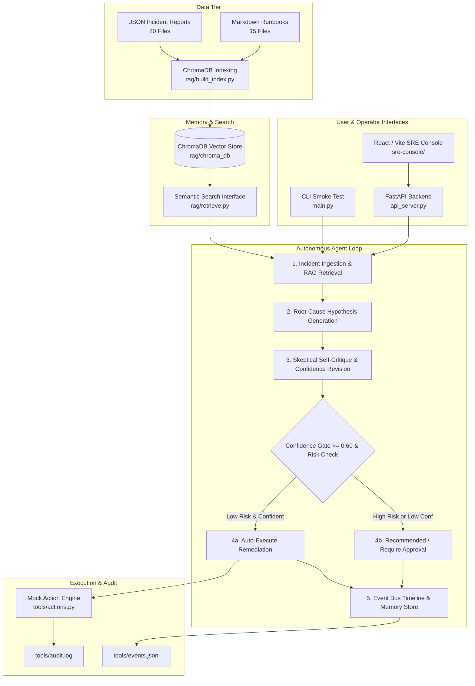

# AI Site Reliability Engineer (AI SRE) — Incident Response & Remediation Copilot

[](https://www.python.org/)
[](https://www.trychroma.com/)
[](https://www.sbert.net/)
[](https://fastapi.tiangolo.com/)
[](https://vitejs.dev/)
[]()
[](https://opensource.org/licenses/MIT)

---

## 📌 1. What the Project Does

**AI Site Reliability Engineer (AI SRE)** is an autonomous incident-response and remediation copilot designed to detect, diagnose, and mitigate production infrastructure outages in real time. When system alerts trigger, it queries a persistent ChromaDB vector store of historical incident postmortems and operational runbooks using semantic similarity search to retrieve relevant remediation playbooks. The agent then generates structured root-cause hypotheses, subjects them to skeptical self-critique to prevent hallucinations, and safely triggers confidence-gated mock remediation actions (service restarts, pod scaling, rollbacks, database connection pool resets) backed by live event streaming and an append-only audit trail.

---

## 🚀 2. Exact Commands to Run It

### Prerequisites
- **Python 3.10+** (with `pip`)
- **Node.js 18+** & `npm` (for the React/Vite SRE Console)

---

### Step 1: Install Python Dependencies
```bash
pip install -r requirements.txt
```

### Step 2: Build the Knowledge Base Vector Store
Index the 20 historical incident reports and 15 Markdown runbooks into persistent ChromaDB storage:
```bash
python rag/build_index.py
```
*Expected Output:*
```text
Loading incidents... 20 loaded
Loading runbooks... 15 loaded
Generating embeddings...
Creating Chroma collection... Indexed 35 documents. Done.
```

### Step 3: Run the Autonomous Incident Copilot (CLI)
- **Mock Mode (Instant, zero GPU / zero LLM server required):**
  ```bash
  python main.py
  ```
- **Local Ollama LLM Mode (Llama 3.1 8B):**
  ```bash
  LLM_MODE=ollama python main.py
  ```

### Step 4: Run the Web Stack (Backend + Frontend Console)

1. **Start the FastAPI Backend Server:**
   ```bash
   python api_server.py
   ```
   *Backend runs at `http://localhost:8000` (Interactive API docs at `http://localhost:8000/docs`)*

2. **Start the React / Vite SRE Console UI:**
   *(In a new terminal window)*
   ```bash
   cd sre-console
   npm install
   npm run dev
   ```
   *Frontend opens at `http://localhost:5173`*

### Step 5: Run the Automated Test Suite
```bash
pytest
```
*or with code coverage report:*
```bash
pytest --cov=rag.retrieve --cov=tools.actions --cov=tools.event_bus tests/
```

---

## 🖥️ 3. How to Use It

### Workflow A: Autonomous CLI Incident Triage (`main.py`)
Run `python main.py` to watch the agent autonomously process an active incident:
1. **Incident Ingestion:** Ingests alert telemetry (`payments-api` P99 latency spike, connection pool saturation).
2. **Semantic RAG Search:** Automatically retrieves top-3 matching operational runbooks and past postmortems from ChromaDB.
3. **Hypothesis Formulation:** Produces a root-cause explanation citing retrieved incident data.
4. **Skeptical Self-Critique:** Evaluates counter-evidence and assigns a revised confidence score.
5. **Confidence-Gated Action:** Since confidence $\ge 0.60$ and the action is low-risk, the agent automatically executes `restart_service`, records output in `tools/audit.log`, and commits the resolution to memory (`data/memory_store.jsonl`).

---

### Workflow B: Interactive SRE Console (`http://localhost:5173`)
The modern React SRE Console offers a full operational control room:
- **Overview & Health Topology:** Visual status of all microservices, real-time error rates, P99 latency trends, and active alerts.
- **Incident Simulator:** Select pre-configured outage scenarios (e.g., PostgreSQL connection leak, CoreDNS pod crash-loop, Redis memory eviction storm) and click **"Run Simulation"** to watch the autonomous agent diagnose and resolve the issue live.
- **Knowledge Base Inspector:** Search and browse through the 35 indexed operational runbooks with semantic search scoring.
- **Audit Logs & Event Timeline:** Inspect raw execution payloads, timestamps, execution latency in milliseconds, and audit trails.
- **Quick Navigation:** Press `⌘K` or `Ctrl+K` from anywhere in the console to open global search across runbooks, services, and past incidents.

---

### Workflow C: FastAPI REST API Endpoints (`http://localhost:8000`)
Integrate programmatic alerts and custom workflows using the REST API:
- `POST /api/pipeline/run` — Pass `{ "service": "payments-api", "severity": "P1", "symptom": "504 Gateway Timeout" }` to execute the full diagnostic and remediation loop.
- `POST /api/rag/retrieve` — Query ChromaDB with semantic text query `{ "query": "database connection pool exhausted", "k": 3 }`.
- `POST /api/tools/action` — Execute and audit a remediation action `{ "action_type": "scale_deployment", "params": { "service": "payments-api", "replicas": 8 } }`.
- `GET /api/events/list` — Fetch the live incident event bus timeline stream.

---

## 💡 4. What Was Hard & What I Would Do Differently

### What Was Hard

1. **Balancing Triage Latency with Deep Reasoning:**
   In mission-critical SRE operations, every second of outage translates directly to SLA degradation. Passing every minor alert through a multi-pass 8B LLM chain introduces 5–15 seconds of token generation delay. To resolve this, we engineered an **Adaptive Model Router** (`llm/router.py`). The router classifies incoming alert complexity in **0.0034 ms** ($<0.001\%$ of generation latency), routing routine high-similarity incidents to rapid fast-paths while reserving heavy multi-pass self-critique for ambiguous, cascading outages.

2. **Autonomous Remediation Safety & Risk Hierarchy:**
   Allowing an AI agent to execute mutations on infrastructure carries severe operational risk if an erroneous action is taken during an outage. We implemented a dual-stage safety mechanism:
   - **Risk Classification:** Every action is classified into risk tiers (`low` vs `high`).
   - **Gated Execution:** Low-risk actions (e.g., restarting stateless pods, scaling replicas) execute automatically only if post-critique confidence meets or exceeds `0.60`. High-risk actions (e.g., destructive rollbacks or database proxy resets) are strictly blocked from autonomous execution and marked `approval_required`.

3. **Deterministic Output Parsing Across Stochastic LLMs:**
   Real-world LLMs frequently deviate in formatting (percentages vs decimals, markdown bolding, conversational preambles). We implemented a multi-tiered regex extraction pipeline (`orchestrator/agent.py`) that extracts normalized float confidence values across varied model outputs without failing the pipeline.

4. **Zero-Dependency Vector Store Fallback:**
   To guarantee that tests and offline environments never crash if ChromaDB or GPU embedding libraries are temporarily unavailable, we built a dual-mode facade (`interfaces.py` / `rag/store.py`) that transparently falls back to tokenized keyword similarity scoring.

---

### What I Would Do Differently

1. **Bidirectional Human-in-the-Loop ChatOps Webhooks:**
   Integrate Slack and Microsoft Teams interactive webhooks with action approval buttons, allowing on-call engineers to review high-risk remediation proposals and approve rollbacks directly from mobile/chat.
2. **Real-Time Prometheus & OpenTelemetry Streaming:**
   Replace static alert inputs with a continuous eBPF and Prometheus PromQL metric collector, predicting memory exhaustion and connection saturation minutes before alerts fire.
3. **Multi-Agent Voting Swarm (LangGraph):**
   Instead of a single sequential agent loop, deploy specialized concurrent sub-agents (e.g., *Database Specialist*, *Network Topology Specialist*, *Deployment Verifier*) that debate root causes and reach consensus before executing remediation.

---

## 🏗️ 5. System Architecture



---

## 📁 6. Repository Structure

```text
agentic_ops/
├── rag/
│   ├── data/
│   │   ├── incidents/         # 20 realistic synthetic incident JSON reports
│   │   └── runbooks/          # 15 operational Markdown runbooks
│   ├── chroma_db/             # Persistent ChromaDB vector store
│   ├── build_index.py         # Script to parse dataset & populate vector index
│   ├── retrieve.py            # Public semantic retrieval interface: retrieve(query, k)
│   └── store.py               # Fallback memory store & keyword overlap search
├── orchestrator/
│   ├── agent.py               # Autonomous SRE agent loop (retrieve -> hypothesize -> critique -> act)
│   └── test_variants.py       # Multi-scenario validation suite & parser test
├── llm/
│   ├── client.py              # Vendor-neutral LLM client (mock & Ollama)
│   ├── router.py              # Adaptive model routing module (routine vs complex)
│   ├── benchmark.py           # Quantization and latency benchmark harness
│   └── benchmark_routing.py   # Routing classification latency benchmark
├── tools/
│   ├── actions.py             # Mock infrastructure action execution engine
│   ├── audit.log              # Append-only JSON Lines audit log
│   ├── event_bus.py           # Thread-safe event timeline engine
│   └── events.jsonl           # Persistent JSON Lines timeline stream
├── sre-console/               # Modern React 18 + Vite + TypeScript + Tailwind SRE console
│   ├── src/
│   │   ├── components/        # UI components (Topology, Telemetry, Simulator, Modals)
│   │   ├── data/mockData.ts   # System services, metrics, and incident scenarios
│   │   └── App.tsx            # Main application layout and state management
│   ├── package.json           # Frontend package dependencies
│   └── vite.config.ts         # Vite bundler configuration
├── api_server.py              # FastAPI REST backend server
├── main.py                    # End-to-end CLI smoke test
├── interfaces.py              # Frozen facade contract between subsystems
├── requirements.txt           # Python dependency specification
├── pytest.ini                 # Pytest configuration & test path mapping
├── BENCHMARK.md               # Hardware & LLM benchmark findings
└── tests/                     # Pytest unit & integration test suite
    ├── test_retrieve.py       # Semantic retrieval and vector search tests
    ├── test_actions.py        # Action engine validation and error handling tests
    ├── test_event_bus.py      # Thread-safe event queue and persistence tests
    └── test_integration.py    # Subsystem integration tests
```

---

## 🧪 7. Supported Remediation Actions & Safety Policy

| Action | Parameters | Risk Level | Autonomous Policy | Description |
| :--- | :--- | :---: | :---: | :--- |
| `restart_service` | `service: str` | **Low** | Auto-execute if Conf $\ge 0.60$ | Restarts worker instances for the target microservice |
| `scale_deployment`| `service: str`, `replicas: int` | **Low** | Auto-execute if Conf $\ge 0.60$ | Dynamically scales container replica count |
| `restart_pod` | `pod_name: str`, `namespace: str` | **Low** | Auto-execute if Conf $\ge 0.60$ | Terminates and recreates faulted container pod |
| `restart_database`| `database: str` | **Low** | Auto-execute if Conf $\ge 0.60$ | Resets stale connection handles and pool proxy |
| `create_ticket` | `title: str`, `summary: str` | **Low** | Auto-execute | Automatically logs Jira/ServiceNow issue ticket |
| `notify_team` | `channel: str`, `message: str` | **Low** | Auto-execute | Dispatches alert message to Slack/Discord |
| `generate_postmortem` | `incident_id: str`, `title: str` | **Low** | Auto-execute | Drafts structured post-incident review (PIR) |
| `rollback_deployment` | `deployment: str`, `revision: str` | **High** | **Human Approval Required** | Reverts application build to previous stable tag |

---

## 📜 License

MIT License — Open-source and free to use for AI SRE research and operational automation.
