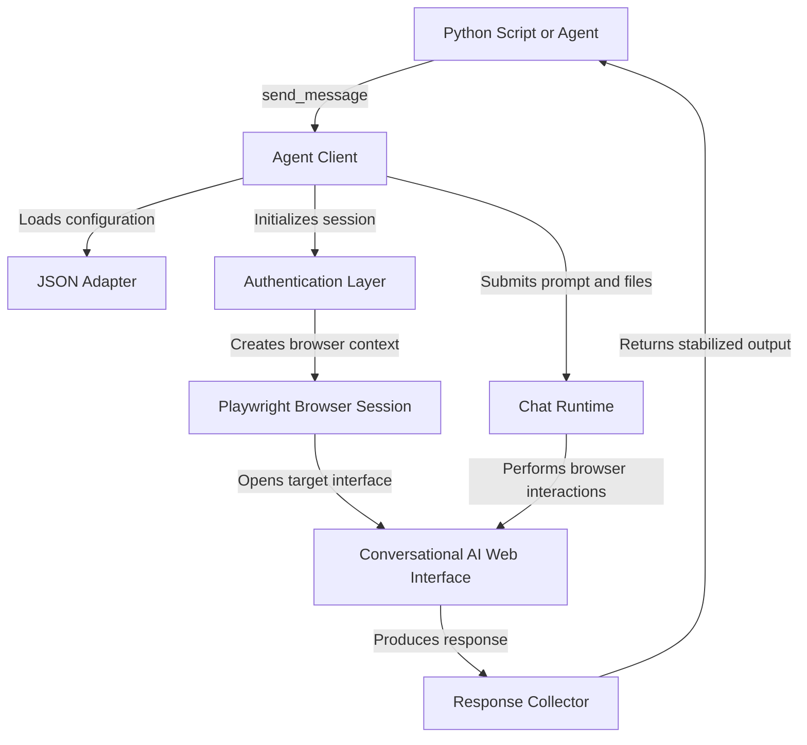

# BrowserAPIFree — Conversational AI Agent Framework

## Overview

BrowserAPIFree is a Python automation framework for scripts and agent workflows that interact with browser-based conversational AI interfaces through authenticated browser sessions.

The project uses Playwright for browser control and separates site-specific UI logic from the core client through JSON adapters.

### Core capabilities

* Reusable browser sessions
* Persistent authentication profiles
* Prompt submission
* Conversation management
* File uploads
* Response collection
* Configurable UI selectors

> This project is intended for automating browser interfaces using accounts and sessions you are authorized to use.

---

# Installation

## 1. Open the project directory

```bash
cd ishaan_chand
```

## 2. Install dependencies

```bash
pip install -r requirements.txt
```

## 3. Install Chromium

```bash
playwright install chromium
```

---

# Authentication

BrowserAPIFree supports multiple authentication approaches depending on the target platform.

## Option A — Persistent Browser Session

For platforms where an authenticated browser profile can be reused:

```bash
python auth_smoke_test.py --test-profile --adapter chatgpt --profile .browser_profiles/chatgpt
```

The browser profile should belong to an account you are authorized to access.

---

## Option B — Persistent SSO Profile

For Google, enterprise SSO, or platforms using device-bound authentication:

```bash
python auth_smoke_test.py --login-sso --adapter notebooklm --profile .browser_profiles/notebooklm
```

A browser window opens for the initial login.

After authentication:

1. Complete the login normally.
2. Return to the terminal.
3. Confirm the login when prompted.

The browser profile is then reused for future sessions.

---

# Authentication Smoke Tests

## ChatGPT

```bash
python auth_smoke_test.py --test-profile --adapter chatgpt --profile .browser_profiles/chatgpt
```

## NotebookLM

```bash
python auth_smoke_test.py --test-profile --adapter notebooklm --profile .browser_profiles/notebooklm
```

---

# Running the Demo

```bash
python example_usage.py
```

---

# Features

## Browser Automation

* Playwright-based Chromium automation
* Visible browser mode for debugging
* Persistent browser profiles
* Configurable startup and timing behavior

## Authentication

* Persistent browser profile support
* Interactive SSO login helper
* Session reuse
* Platform-specific authentication handling

## Conversation Management

* Locate an existing conversation
* Create a new conversation when required
* Send prompts programmatically
* Wait for generated responses
* Return stabilized response text

## File Uploads

* Local file attachment support
* Multi-file workflows where supported
* Browser-native upload handling

## Response Collection

The response collector monitors the active conversation and waits for output to stabilize before returning control to the calling script.

It can track:

* Response start
* Time to first visible output
* Response completion
* Stabilized text

## Adapter-Based Design

Site-specific selectors and interaction rules are stored separately from the Python client.

```text
adapters/
├── chatgpt.adapter.json
├── notebooklm.adapter.json
└── ...
```

This allows UI selectors to be updated without modifying the core automation logic.

---

# Architecture



---

# Basic Example

```python
from pathlib import Path

from agent_client import ChatGPTAgentClient


profile_path = Path(".browser_profiles/chatgpt")

client = ChatGPTAgentClient(
    profile_path=profile_path,
    chat_name="Agent Workspace",
    headless=False,
)

try:
    client.start(create_if_missing=True)

    response = client.send_message(
        "Explain the CAP theorem in three bullet points."
    )

    print(response)

finally:
    client.close()
```

---

# Design Challenges

## 1. Browser UI Changes

Browser automation depends on interfaces that can change without notice.

Selectors may stop working because of:

* UI redesigns
* Component changes
* Accessibility changes
* Renamed controls
* Altered page structure

### Approach

Site-specific behavior is isolated in adapter files rather than embedded throughout the client implementation.

This reduces the amount of Python code that must be changed when a UI changes.

---

## 2. Different Authentication Models

Authentication is not consistent across platforms.

Some services rely primarily on browser session state, while others use combinations of:

* Cookies
* Local storage
* IndexedDB
* OAuth state
* Device-bound credentials

### Approach

The framework supports persistent browser profiles so the browser can retain authentication state created through a normal login flow.

---

## 3. Browser Startup Overhead

Starting a new Chromium instance for every request introduces unnecessary latency.

A future improvement would be a local service that maintains active browser sessions.

```text
Python Script
      |
      v
Local Client
      |
      v
Session Manager
      |
      +------ Browser Session A
      |
      +------ Browser Session B
      |
      +------ Browser Session C
```

This would allow multiple requests to reuse an already-running browser session.

---

## 4. Streaming Responses

The current response collector returns text after the response has stabilized.

A future version could expose a streaming interface:

```python
for chunk in client.stream_message(
    "Explain distributed systems."
):
    print(chunk, end="", flush=True)
```

This would make the framework more suitable for terminal applications and agent pipelines.

---

# Project Structure

```text
BrowserAPIFree/
│
├── agent_client.py
├── auth_smoke_test.py
├── example_usage.py
├── requirements.txt
│
├── adapters/
│   ├── chatgpt.adapter.json
│   └── notebooklm.adapter.json
│
├── .browser_profiles/
│
└── README.md
```

---

# Security

Browser profiles and session data may contain sensitive authentication information.

The following should never be committed to a repository:

```text
.browser_profiles/
cookies.json
.env
```

Recommended `.gitignore` entries:

```gitignore
.browser_profiles/
cookies.json
.env
__pycache__/
*.pyc
```

Do not share browser profiles or authentication credentials.

---

# Limitations

Browser automation is inherently less stable than a dedicated API.

Potential issues include:

* UI changes breaking selectors
* Authentication sessions expiring
* Browser updates affecting automation
* Target websites changing interaction behavior
* Platform terms restricting automated access

Adapters may require periodic maintenance.

---

# Roadmap

* [ ] Persistent session manager
* [ ] Streaming response API
* [ ] Better error recovery
* [ ] Automatic adapter validation
* [ ] Conversation state abstraction
* [ ] Structured response metadata
* [ ] Multi-session orchestration
* [ ] Local daemon mode
* [ ] Plugin interface for additional adapters

---

# License

MIT License.
